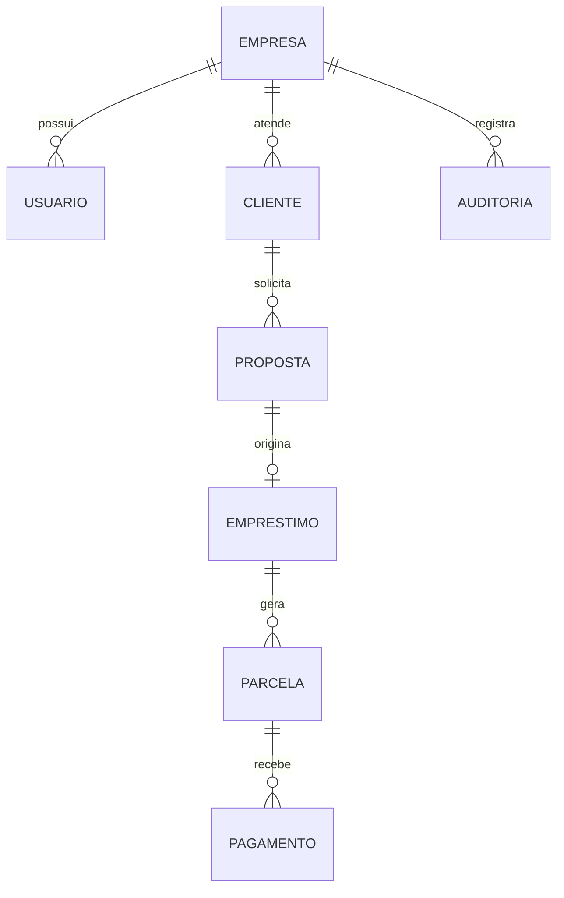

# Arquitetura do Control Premium

Status: decisão inicial aprovada para orientar a implementação  
Data: 24/07/2026

## 1. Objetivo

Construir um SaaS multiempresa para gestão de clientes, propostas, empréstimos, parcelas, pagamentos, contratos, cobrança e comunicação. A interface do protótipo é a referência visual, mas seu HTML monolítico não será usado como arquitetura de produção.

## 2. Princípios

1. Preservar a identidade visual aprovada.
2. Separar interface, domínio, persistência, autenticação, integrações e testes.
3. Isolar rigorosamente os dados de cada empresa.
4. Tratar dinheiro com precisão decimal, idempotência e razão auditável.
5. Não armazenar segredos no repositório.
6. Integrar provedores externos por adaptadores substituíveis.
7. Registrar ações sensíveis e alterações financeiras.
8. Começar pela aplicação web; criar Flutter somente após estabilização da API.
9. Manter revisão humana em decisões de crédito e mensagens sensíveis.
10. Entregar mudanças pequenas, verificáveis e reversíveis.

## 3. Stack alvo

| Camada | Tecnologia inicial | Responsabilidade |
|---|---|---|
| Web | Next.js + React + TypeScript | Interface responsiva e rotas |
| API inicial | Route Handlers/Server Actions do Next.js | Casos de uso e integrações |
| Banco | PostgreSQL no Supabase | Dados transacionais |
| Autenticação | Supabase Auth | Identidade, sessão e recuperação |
| Autorização | RLS + políticas da aplicação | Isolamento e permissões |
| Arquivos | Supabase Storage | Documentos e imagens |
| Filas/automações | Serviço de fila e n8n, quando necessário | Processos assíncronos |
| Testes | Unitários, integração e E2E | Regras, isolamento e fluxos |
| Web hosting | Vercel | Aplicação web |
| Mobile futuro | Flutter | Android e iPhone |

NestJS será considerado somente quando o volume, a complexidade operacional ou a separação de serviços justificar um backend independente.

## 4. Estrutura prevista

```text
apps/
  web/
  mobile/
packages/
  ui/
  domain/
  config/
supabase/
  migrations/
  seed/
docs/
tests/
prototype/
  ControlPremium_PROTOTIPO_OFICIAL_V1.html
```

`apps/mobile` será criado apenas no Bloco R. A estrutura poderá ser iniciada sem código para manter o mapa do monorepo.

## 5. Fronteiras da aplicação

### Interface

- Componentes React reproduzem fielmente o protótipo.
- Nenhum componente acessa diretamente o banco ou credenciais.
- Estados de carregamento, vazio, erro e permissão são explícitos.
- Valores monetários chegam formatados a partir de tipos do domínio.

### Domínio

- Contém regras de clientes, propostas, empréstimos, parcelas, pagamentos e cobrança.
- Não depende de React, Supabase ou provedores externos.
- Cálculos financeiros usam representação decimal segura.
- Toda mudança financeira produz evento auditável.

### Aplicação

- Orquestra casos de uso.
- Aplica permissões antes de acessar dados.
- Inicia transações e idempotência.
- Chama adaptadores de PIX, WhatsApp, assinatura e IA.

### Infraestrutura

- Implementa repositórios PostgreSQL/Supabase.
- Implementa Storage, filas, e-mail e adaptadores de terceiros.
- Recebe webhooks com autenticação, deduplicação e reprocessamento seguro.

## 6. Multiempresa

Toda entidade empresarial terá `tenant_id`, salvo tabelas globais explicitamente justificadas. O isolamento será aplicado em quatro níveis:

1. sessão identifica usuário e empresa;
2. API valida papel e permissão;
3. consultas filtram `tenant_id`;
4. RLS impede acesso cruzado mesmo quando a aplicação falha.

Testes obrigatórios provarão que usuários, clientes e arquivos da Empresa A não podem ser lidos ou alterados pela Empresa B.

## 7. Identidade e autorização

- Login por e-mail ou telefone e senha.
- CPF é dado cadastral, nunca senha ou única credencial.
- Confirmação de contato e recuperação de senha.
- MFA para funções administrativas.
- Papéis iniciais: Super Admin, Administrador, Gestor, Cobrador e Cliente.
- Permissões verificadas em página, API, Storage e banco.
- Sessões revogáveis e tentativas inválidas auditadas.

## 8. Dados principais



Outras entidades previstas: contatos, endereços, documentos, contratos, assinaturas eletrônicas, eventos de cobrança, renegociações, notificações, transações PIX, webhooks, planos e assinaturas SaaS.

## 9. Núcleo financeiro

- Valores em `numeric/decimal`, nunca `float`.
- Cronograma gerado por regra versionada.
- Pagamentos integrais e parciais dentro de transação.
- Idempotency key obrigatória para comandos repetíveis e webhooks.
- Razão financeira registra débitos, créditos, estornos e saldo.
- Operações confirmadas não são apagadas; correções usam estorno ou evento compensatório.
- Cálculos de juros, arredondamento, dias úteis, feriados e distribuição de pagamento dependem de decisão de negócio documentada.

## 10. Integrações

### PIX

Um contrato `PixProvider` separará o domínio do provedor. O adaptador deverá gerar cobrança, consultar estado, validar webhook e solicitar devolução quando permitido. A conta será real e verificada; a homologação do próprio provedor será usada primeiro quando disponível.

### WhatsApp

Um contrato `MessagingProvider` controlará templates, destinatário, idempotência, tentativas, status e opt-out. O número será real e verificado. Os primeiros envios serão restritos ao proprietário ou destinatários de teste autorizados.

### IA

A IA auxiliará em redação, resumo e priorização explicável. Dados serão minimizados ou mascarados. Saídas relevantes terão versão do modelo, prompt, revisão humana e auditoria. A IA não aprovará nem negará crédito sozinha.

## 11. Ambientes

| Ambiente | Finalidade | Dados |
|---|---|---|
| Local | Desenvolvimento | Fictícios |
| Homologação | Integrações e aceite | Fictícios; contas reais conectadas nos modos permitidos |
| Produção | Operação autorizada | Reais, após revisão |

Variáveis serão cadastradas em painéis protegidos. O repositório terá somente `.env.example` com nomes, nunca valores.

## 12. Observabilidade e segurança

- Logs estruturados com correlação, sem segredos.
- Trilhas de auditoria para autenticação, permissões e finanças.
- Alertas para falhas de webhook, filas e integrações.
- HTTPS, cabeçalhos de segurança, rate limit e proteção contra ataques comuns.
- Backups automatizados e restauração testada.
- Retenção, exportação, anonimização e descarte conforme regras aprovadas.

## 13. Decisões registradas

| Decisão | Motivo |
|---|---|
| Reconstruir em Next.js/TypeScript | Componentização, tipagem e entrega web rápida |
| PostgreSQL/Supabase | Transações, integridade, Auth, Storage e RLS |
| API inicial no Next.js | Menor complexidade no MVP |
| Integrações por adaptadores | Evitar dependência rígida de um fornecedor |
| Web antes de Flutter | Estabilizar regras e API antes de duplicar clientes |
| Protótipo imutável | Garantir referência visual e comparação |

## 14. Itens proibidos

- Transformar o HTML atual no backend do produto.
- Usar `localStorage` como banco.
- Gravar documentos em Base64 no navegador.
- Usar CPF como senha.
- Persistir segredos, tokens ou certificados no Git.
- Misturar dados entre empresas.
- Confirmar pagamento somente por retorno visual do navegador.
- Automatizar decisões de crédito exclusivamente por IA.
