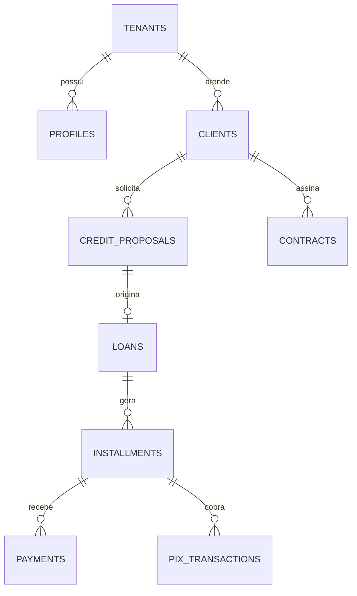

# Modelo de dados multiempresa

Status: estrutura técnica versionada; aplicação no projeto Supabase real permanece na lista final.

## Visão geral

## Regras estruturais

- Toda tabela empresarial possui `tenant_id`.
- Relações principais usam chaves estrangeiras compostas por `tenant_id` e identificador, impedindo vínculos cruzados entre empresas.
- Valores monetários são inteiros em centavos e nunca `float`.
- Operações financeiras confirmadas serão corrigidas por estorno, não por exclusão.
- Cobranças, mensagens e pagamentos possuem chave de idempotência.
- Webhooks são deduplicados pelo identificador do provedor e registram hash do conteúdo.
- Documentos ficam em bucket privado e o primeiro segmento do caminho é o `tenant_id`.
- RLS é habilitado em todas as tabelas operacionais.

## Grupos de tabelas

| Grupo | Tabelas |
|---|---|
| Empresa e acesso | `tenants`, `profiles`, `role_permissions`, `member_invitations`, `auth_events` |
| Cliente | `clients`, `client_contacts`, `client_addresses`, `client_documents` |
| Crédito | `credit_proposals`, `loans`, `installments`, `payments` |
| Cobrança | `collection_events`, `renegotiations`, `notifications` |
| Contrato | `contracts` |
| Integrações | `pix_transactions`, `webhook_events`, `idempotency_keys` |
| SaaS | `saas_plans`, `saas_plan_limits`, `tenant_subscriptions` |
| Auditoria | `audit_logs` |

## Permissões iniciais

| Papel | Escopo |
|---|---|
| Super Admin | Administração global auditada |
| Administrador | Empresa, membros, clientes, propostas e finanças |
| Gestor | Membros, operação, aprovação e finanças sem estorno |
| Operador | Clientes, propostas e leitura financeira |
| Cobrador | Clientes, cobrança e leitura financeira |
| Cliente | Somente o próprio portal |

CPF permanece dado cadastral opcional. Autenticação usa Supabase Auth por e-mail ou telefone e senha, com confirmação de contato, recuperação de senha e MFA administrativo configurados no ambiente real.
